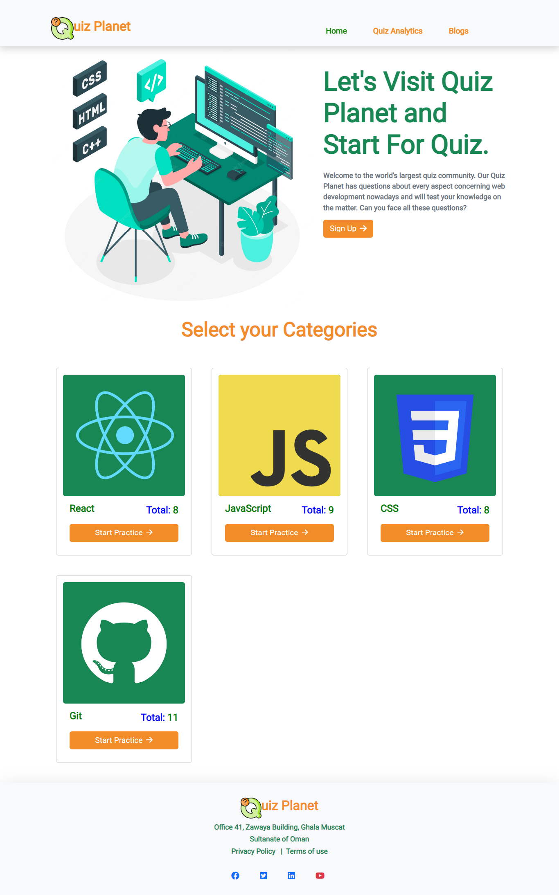
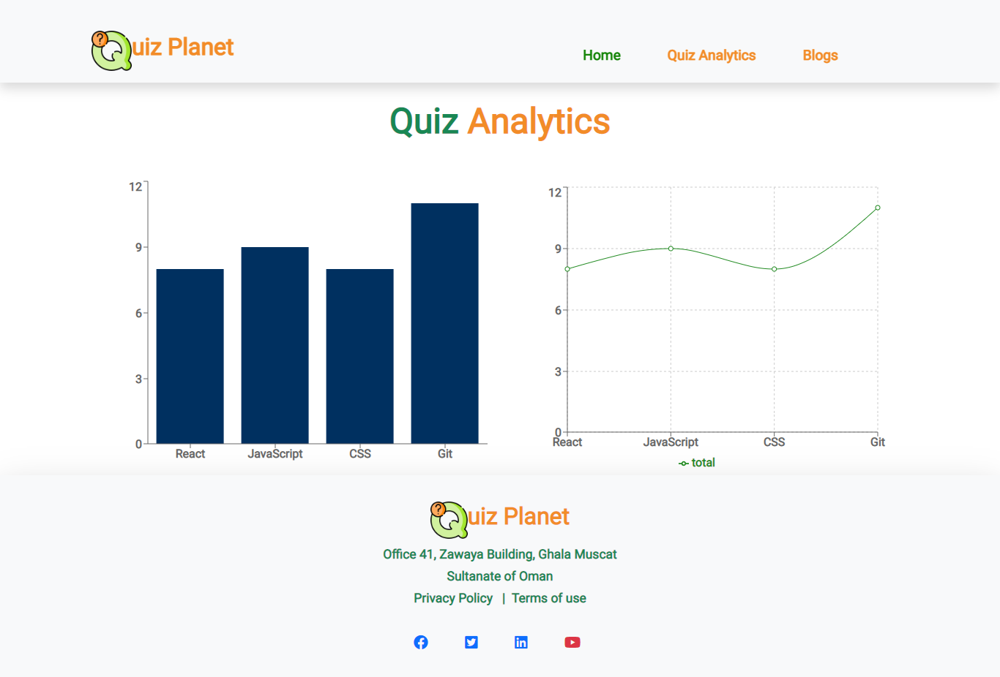

# Quiz Planet Website Application
 

<!-- This project was bootstrapped with [Create React App](https://github.com/facebook/create-react-app). -->

## Demo

Visit: https://quiz-planet-9b21f5.netlify.app/
### Home Page

### Quiz Analytics Page

# About  This Project.

Quiz Planet is an online quiz organizing website project
,developed using Bootstrap,React,React Router,Vanila CSS ,Javascript Framework. 
React Router DOM which is used here  that enables to implement dynamic routing in a web app.It allows  to display pages and allow users to navigate them.
 
Font Awesome React which  is React Component used here for using icon  in React applications and also Recharts which is a composable charting library built on React components is used for charts.

# API LINK:
Get all quiz topics: https://openapi.programming-hero.com/api/quiz
 
Get topic details by topic id: https://openapi.programming-hero.com/api/quiz/${id}

# Current Features:
-  Practice quiz of different categories about  web development
- Can easily verificate   skills by knowing the answers.
- Immediately  they can know the right answer 
- If they give their answers wrong they will give the information immediately
- Can Acquire Knowledge about different aspects of web development from the blog
- Give a opportunity of Quiz Analytics 
- Site is responsive that allows  website content to flow freely across all screen resolutions and sizes, and renders it to look great on all devices

# Built With

<ul>
  <li>Semantic HTML5 markup</li>
  <li>Vanila CSS</li>
   <li>Bootstrap</li>
   <li>React</li>
   <li>React Router</li>
<ul>

 
